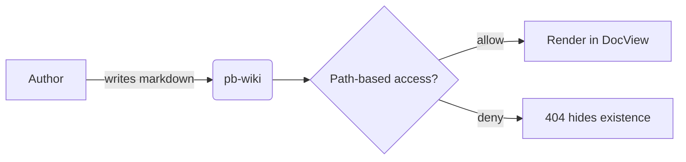
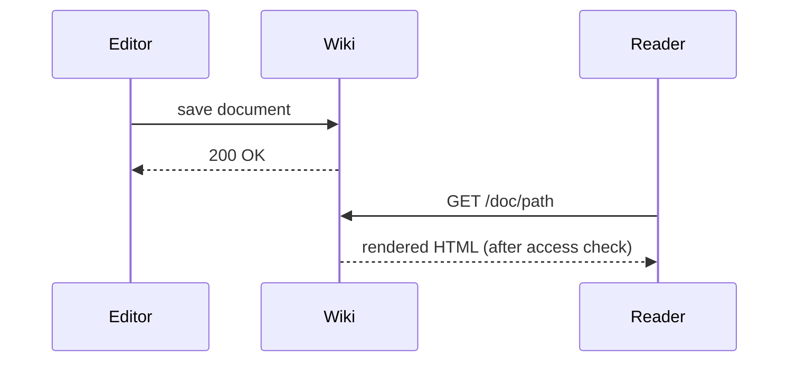

This page demonstrates every markdown feature pb-wiki renders. It doubles as
an import smoke test — `go run . import ./examples` should upsert it cleanly.

# Headings

`#` through `####` are the levels you'll typically use. Each heading gets an
auto-generated `id` so the TOC sidebar can scroll to it and `#fragment` URLs
work. Don't put an H1 at the top of the body — the page title (set in the
frontmatter or the editor's Title field) already serves that role.

## Second-Level
### Third-level heading
#### Fourth-level heading

# Text formatting

**bold**, *italic*, ***bold italic***, ~~strikethrough~~, `inline code`.

Highlight a phrase with `==marker==` → ==highlighted text==.

Subscript `H~2~O` renders as H~2~O. Superscript `E=mc^2^` renders as E=mc^2^.

A blank line separates paragraphs. A single newline inside a paragraph stays a
space (`breaks: false`) — you have to leave a blank line to start a new one.

# Links

[Inline link](https://example.com) — bracketed text, URL in parens.

Bare URLs auto-link thanks to `linkify: true`: https://example.com.

External links (anything `http(s)://`) open in a new tab with safe
`rel="noopener noreferrer"`. Relative links and `#fragment` URLs stay in-app
so SPA navigation isn't broken — link to other wiki pages by path:
[Getting started](getting-started/install) or [the homepage](.).

# Lists

Unordered:

- First item
- Second item
  - Nested item
  - Another nested item
- Third item

Ordered:

1. First
2. Second
3. Third

Task list — checkboxes are interactive in the rendered view:

- [x] Completed task
- [ ] Pending task
- [ ] Another pending task

# Blockquotes

> A single-line quote.

> A multi-paragraph quote with **inline formatting** and a [link](https://example.com).
>
> The second paragraph of the same quote.

# Code blocks

Inline `code` with backticks.

A fenced code block. The saved view doesn't ship syntax highlighting — the
editor preview highlights for readability while authoring, but the rendered
page shows code as plain monospace:

```go
func main() {
    fmt.Println("hello, pb-wiki")
}
```

# Tables

Pipe-delimited tables with optional column alignment (`:---`, `---:`, `:---:`):

| Column 1 | Right-aligned | Centered |
|----------|--------------:|:--------:|
| left     |             1 |    x     |
| left     |            42 |    y     |
| left     |           999 |    z     |

# Images

A bare image (no caption):


With a caption — the third argument (the title attribute, in quotes) becomes a
`<figcaption>` beneath the image. Alt text stays on the `` for screen
readers:


To embed your own images, drag-and-drop or paste them into the editor — they
upload to the `assets` collection and an `` reference is inserted at the
cursor.

# Horizontal rule

Three dashes on a line by themselves:

---

# Callouts

Four flavors: `note`, `tip`, `warning`, `danger`. The container syntax is
`::: name` to open and `:::` to close.

::: note
A neutral aside. Good for clarifying context or pointing at a related page.
:::

::: tip
A helpful recommendation or best practice.
:::

::: warning
Something the reader should be careful about — a possible footgun or a
surprising default.
:::

::: danger
A destructive or irreversible action — data loss, security implications, etc.
:::

# YouTube embeds

A line containing only a YouTube URL becomes an embedded player. `watch?v=`,
`youtu.be/`, `shorts/`, and `embed/` URLs all work, and a `?t=` / `?start=`
parameter is preserved.

https://www.youtube.com/watch?v=dQw4w9WgXcQ

# Suppressing the auto-TOC

By default the right-hand sidebar auto-builds a table of contents from the
H2/H3 headings on the page. To hide it for a particular doc, place this
HTML-comment directive on the very first line of the body (before any other
content):

    <!-- toc: false -->

`<!-- no-toc -->` works too. The directive is stripped from the rendered
output, so it never appears as visible text.

# Diagrams (Mermaid)

A ` ```mermaid ` fenced block renders as a [Mermaid](https://mermaid.js.org)
diagram. The library is lazy-loaded on first use, so docs without diagrams
pay no bundle cost.





The diagram theme follows the wiki's light/dark mode.

# Frontmatter

If a doc body starts with a YAML frontmatter block (`---` … `---` on the
very first lines), it renders as a small key/value table at the top of the
page — the same shape GitHub shows when viewing a raw `.md` file. Only
flat `key: value` lines are parsed; lists and nested maps fall through.

The on-disk `.md` for this page starts with:

```yaml
---
path: examples/markdown-reference
title: Markdown reference
---
```

…but the importer parses the YAML to populate the `path` and `title`
collection fields and strips the block from the body before saving, so the
imported version of this doc won't render a frontmatter table. To see the
feature in action, paste a frontmatter block into the editor manually — it
will render in both the preview pane and the saved view.

# Things to know

- **Raw HTML is stripped.** `html: false` is set on both the saved view and
  the editor preview, so `<script>` tags and inline event handlers like
  `onerror=` render as escaped text instead of executing — even when typed
  by an editor account.
- **KaTeX doesn't render in the view.** md-editor-v3's preview pane will
  render math (`$$…$$`), but pb-wiki's view doesn't ship KaTeX. Use an
  image or describe the formula in prose if it has to appear on the page.
- **Heading anchors are invisible.** There's no `#` permalink icon next to
  headings — the sidebar TOC is the navigation affordance, and `#fragment`
  URLs jump to the right heading because each carries an `id`.
